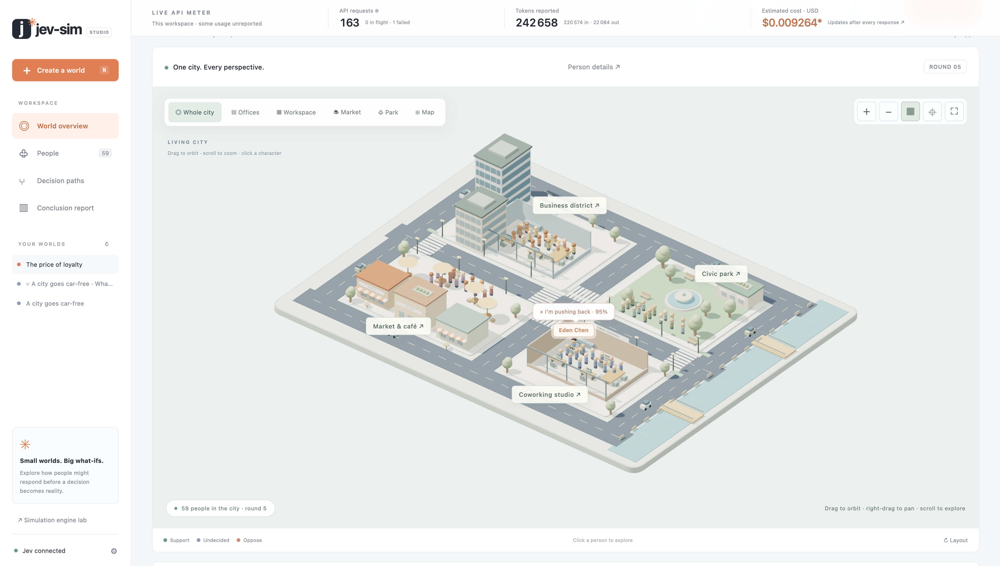

# Jev-Sim

**Create people. Explore their decisions. Watch possible futures unfold.**

An interactive 3D world studio and provider-independent Python simulation framework. Describe a scenario, generate synthetic personas with the real Jev API, and watch them decide, remember, and respond to their peers. Inspect every probability and explore what changes when one person takes a different path.

**Status: early preview (0.1.0).** Designed to run locally. Synthetic outcomes are exploratory, not validated forecasts.



## Run it

Python 3.10 or newer. No runtime dependencies or frontend build. The dashboard and CLI use the real TypeSafe Jev API by default; offline demo mode is an explicit option.

```sh
git clone https://github.com/jadouse5/jev-sim.git
cd jev-sim
python3 -m jevsim serve --port 3007
# Open http://localhost:3007
```

### Connect Jev

**In the interface:** click **Connect Jev**, paste your TypeSafe API key, choose a model and per-operation request budget, then click **Save to .env**. The server creates `.env` in the directory where you launched it. Existing unrelated settings are preserved, and the file is written atomically with owner-only permissions (`0600`). The saved key never appears in the settings response, browser storage, or exported simulation data. **Test saved key** performs one real inference call.

**From the cloned repository:**

```sh
cp .env.example .env
# Edit .env and set TYPESAFE_API_KEY to your key.
```

```dotenv
TYPESAFE_API_KEY=your-typesafe-api-key
TYPESAFE_MODEL=jev-latest
JEV_SIM_MAX_REQUESTS=1000
```

Get a key from [TypeSafe](https://console.typesafe.ai/settings/keys). The interface also offers a downloadable `.env.example`. Reopen **Connect Jev** after editing the file to refresh the connection indicator; the next run reads it without a server restart. `.env` takes precedence over process environment variables. Values are read as data; shell commands and variable expansion are never executed. `.env` and temporary credential files are gitignored.

### Build a world

1. Click **Create a world**. Start from a car-free city, four-day workweek, subscription price change, or your own question.
2. Add scenario facts and stakeholder roles. Plain-text and Markdown files can supply context. Choose any population size and a seed; each API operation stays within your configured request budget.
3. **Generate people & world** makes one real Jev request per person. Edit names, roles, biographies, and goals before the first round.
4. Press **Run simulation**. Each person considers their own priorities, recent memory, connected peers, and injected events. Each person uses one request per round.
5. Watch the **Living world**: individual 3D characters think, wave, push back, consult peers, or advocate, with decision bubbles showing actual action probabilities. Drag to orbit, scroll to zoom, expand the scene, or click a character to inspect them.
6. Rewind with the timeline, switch to the social graph, or open **Decision paths** to inspect model input and alternative actions.
7. Inject an event or fork a completed round into a **parallel world**. Optionally force one person's next action. Run the fork, then compare both worlds under **Conclusion report**.

Worlds save automatically in `artifacts/worlds/` in the launch directory. Reloading or restarting restores completed rounds. **Export world** downloads personas, memories, network edges, events, snapshots, and full decision records. These files never contain the API key.

**Stop** prevents subsequent decisions. An in-flight API call may finish; completed rounds remain saved, while an unfinished round is discarded. If generation stops after at least two people, **Run N generated people** recovers the saved cast and builds its network without regenerating or discarding those personas. Events added during a round arrive at the next round boundary. The server prevents two simultaneous runs of the same world.

No inference happens automatically on opening the app, saving a key, replaying records, switching worlds, or inspecting alternatives. Each generation/run/interview has its own request budget. There are no automatic retries or silent fallback models. For offline exploration choose **Demo · local rules** explicitly; the simulation uses handcrafted probabilities and is labeled as demo.

### Explore the 3D city

The expanded city includes a business district with towers and cutaway offices, a coworking studio with desks and meeting space, a market and café terrace, a civic park, and a waterfront. Use **Whole city**, **Offices**, **Workspace**, **Market**, **Park**, or **Map** to move the camera. Zoom with the scroll wheel or +/− controls, right-drag to pan, and use fullscreen for a larger view. The interiors button toggles workspace roofs.

Click a character or their name to focus the camera and open their real decision details. All people appear in the city; district placement and ambient traffic are illustrative scenery. The simulation’s saved and live choices drive character reactions. Repeated city geometry is instanced, shadows are cached, and nearby people use more detailed meshes to keep the larger scene responsive.

### Read and print conclusions

Click **Report** in the top bar or **Conclusion report** in the sidebar. The report summarizes the latest completed round: final positions, changes among the original people, stakeholder outcomes, actions, plausible drivers, uncertainty, interventions, and a suggested next experiment. People added after that round are excluded until they participate. Reports describe simulated outcomes; they are not validated predictions.

Use **Print / Save PDF** to print a clean report or choose Save as PDF in your browser. **Download report** saves a self-contained HTML copy that opens offline and includes the selected world comparison. Reports use saved records and make no additional API requests.

### Grow the population and watch usage

Click **Add people**, enter a batch size, and generate more people into the current world. There is no fixed population cap. Each newly generated person is saved immediately and joins the next round; cancellation keeps successful additions. Existing personas, memories, and completed-round snapshots are preserved. Forks from earlier rounds exclude later arrivals. The 3D city shows the entire population at once, with simpler character geometry in the distance and detailed people near the camera. The social graph uses selectable pages of 24 people; every person still participates in simulation. The People directory has search and pagination.

The sticky **Live API meter** shows workspace-wide requests, in-flight/failed calls, reported input/output tokens, and estimated USD cost. It updates after each response and by polling the local server. Accounting persists in `artifacts/usage.json`, including billed responses from runs that later fail or are cancelled. Demo calls do not increment it. It covers calls made through this app after tracking was installed, not historical account usage or the provider's invoice.

Pricing is based on the [official model documentation](https://docs.typesafe.ai/models), checked September 20, 2026: `jev-1.13.0` input is **$0.042 per million tokens**, and output is free. The actual returned model and token counts determine each estimate. Unknown models or missing token reports produce an explicitly incomplete estimate; they are not treated as free requests. Click the meter for its rate, source, and detailed totals. API credentials are never written to the usage ledger.

**Live API requests** shows the last 100 calls from the current operation: the person, request body (without credentials), in-flight/completed/error status, response latency, and returned probability distributions. Click a character and **View request & response**, or select a request in the console. **Follow the person deciding** tracks the active character; manually selecting a person keeps the inspector on them. In-progress decisions are clickable before the round commits.

Jev responses can contain small rounding discrepancies such as a total of 0.99 or 1.01. The Jev adapter accepts deviations up to half a percentage point per option, capped at 2.5 percentage points, and normalizes them for sampling. The original values and total are retained in records and shown in the API console. Missing options, negative/non-finite/out-of-range values, zero totals, and larger discrepancies are rejected. The simulator's core and generic HTTP probability contracts remain strict.

The original environment dashboard remains available at **[/lab](http://localhost:3007/lab)**, with Monte Carlo, replay, branching, traces, counterfactuals, and failure hunting.

### What the people represent

The scenario-to-personas-to-simulation workflow is inspired by [MiroFish](https://github.com/666ghj/MiroFish). This is an independent implementation using typed probabilistic decisions, not a copy of MiroFish's social-platform engine.

Jev selects priority, temperament, openness, and initial stance through four Choice questions in one request. Names are synthetic and biographies are composed locally from those traits. Decisions use separate action and driver questions. **Ask a question** returns a locally composed yes/no/unsure response grounded in the persona's memory; it is not unconstrained generated dialogue and does not modify memory.

Each round is synchronous: everyone sees the same starting snapshot. Support/opposition move stance by ±0.22, asking peers blends toward their mean stance by 0.15/0.35/0.60 according to openness, and advocacy gives a speaker 1.5× weight in peers' next consultation. Waiting holds stance. People remember their last eight rounds. Initial network edges form sparse connected neighborhoods, with a link to the preceding person and a small seeded sample favoring shared roles and priorities. User events become model context, not direct hardcoded sentiment changes.

The 3D town is a visual stage for social interactions. Walking and gestures illustrate the selected decision; spatial movement does not alter the modeled network. The renderer uses locally bundled [Three.js](https://threejs.org/) 0.180.0 with orbit controls and no runtime CDN. WebGL 2 is required for 3D; the SVG graph and all simulation features remain accessible without it.

These are **scenario projections from synthetic people**, not a representative sample, a survey, or calibrated real-world predictions. Shares describe the simulated cast. Action probability is not probability of real-world success; entropy describes model uncertainty, not accuracy. Seeds reproduce sampling for identical returned probabilities, but live provider responses can vary. A fork preserves the recorded state and seed, not a claim of causal identification.

Install the CLI into a virtual environment if desired:

```sh
python3 -m venv .venv
source .venv/bin/activate
python -m pip install --upgrade pip
pip install -e .
jev-sim serve
```

## Three simulation modes

```sh
# Highest-probability action at each step
python3 -m jevsim run warehouse

# Sample actions and environment transitions
python3 -m jevsim run warehouse --episodes 10 --seed 42 \
  --output results.json --trace failure.json

# Explore a bounded probability tree
python3 -m jevsim explore warehouse --depth 4 --branches 3 \
  --max-nodes 150 --output tree.json

# Inspect a recorded failure without rerunning a model
python3 -m jevsim replay failure.json

# Force each alternative action at zero-based step 2
python3 -m jevsim replay failure.json --step 2 --episodes 10

# Search varied initial conditions
python3 -m jevsim fuzz support --scenarios 10 --episodes 5 \
  --output findings.json
```

Replay chooses the policy's argmax; environment transitions remain stochastic. Seeds make runs reproducible for deterministic policy outputs. Monte Carlo samples both distributions. Branch mode multiplies action and transition probabilities, retains separate terminal/frontier/pruned mass, and never renormalizes away unexplored futures. Breadth-first expansion is bounded by depth, branching factor, minimum mass, and node count.

## Python API

```python
from jevsim import Simulation
from jevsim.environments import Warehouse
from jevsim.models import DemoPolicy

sim = Simulation(
    environment=Warehouse(battery=72, obstacle_rate=0.22),
    policy=DemoPolicy(),
)
results = sim.run(episodes=10_000, max_steps=40, seed=42)
results.report()
tree = sim.explore(depth=8, branches=3, max_nodes=1500)

from jevsim.analysis.counterfactual import counterfactual

failed = next(t for t in results.trajectories if "failure" in t.outcome)
failed.save("failure.json")
alternatives = counterfactual(sim, failed, step=0, episodes=200)
```

`JevSim` is an alias for `Simulation`. A trace stores the initial state, environment parameters, seed, policy identity, every decision distribution, selected action, transition, reward, metadata, and outcome. Counterfactuals resume a stored state, intervene on one action, then sample a continuation policy with a fresh seeded rollout. They are model-based simulations, not causal claims about an external production system.

## Use your policy

```python
from jevsim.models import Jev, LocalJev, HTTPPolicy, FunctionPolicy

# Reads TYPESAFE_API_KEY from the environment. Explicit inference-call budget.
policy = Jev(model="jev-latest", max_requests=1000)

# A local service implementing the generic endpoint contract below
policy = LocalJev(endpoint="http://localhost:8000/decide")

# Any custom HTTP service
policy = HTTPPolicy("https://your-policy.example/decide", max_requests=1000)

# Or ordinary Python: return a legal action, Decision, or probability dict
policy = FunctionPolicy(lambda state, actions, objective: "RETURN")
```

The configured request budget applies independently to each run, exploration, failure search, or counterfactual operation. Exhausting it stops the operation with an explicit error and retains live progress. The results tree for replay and Monte Carlo uses recorded decisions, so rendering it adds no inference calls. For large offline experiments: `python3 -m jevsim run warehouse --policy demo --episodes 10000`.

The TypeSafe adapter implements the official [Choice request and response contract](https://docs.typesafe.ai/primitives/choice). It sends state, action descriptions, and the environment objective to `/v1/systemone`; returned model identity and usage are preserved in traces. There are no silent fallbacks or automatic retries. The real adapter, streaming path, and credential lifecycle are covered by transport-fixture tests. The world studio has also been exercised against the authenticated Jev API for persona generation and live social decisions. Respect your provider's terms when publishing results or using outputs.

Generic HTTP request:

```json
{"state": {"battery": 31}, "actions": {"GO": "Continue", "STOP": "Stop safely"}, "objective": "Reach the target safely"}
```

Generic HTTP response:

```json
{"probabilities": {"GO": 0.3, "STOP": 0.7}, "confidence": 0.4}
```

Each legal action must appear exactly once. Probabilities must be finite, nonnegative, and sum to one (tolerance `1e-6`). `confidence` is optional and distinct from an action's probability. Local/OpenJev implementations can use this contract; no provider-specific OpenJev API is assumed.

## Build an environment

```python
from jevsim import Transition

class Switch:
    name = "switch"
    title = "Switch"

    def reset(self, seed=0):
        return {"powered": False}

    def actions(self, state):
        return {"ON": "Turn the switch on", "WAIT": "Keep waiting"}

    def transitions(self, state, action):
        if action == "ON":
            return [Transition({"powered": True}, reward=1, outcome="success")]
        return [Transition(dict(state), reward=-0.1)]

    def objective(self):
        return "Turn on the switch"
```

Environment methods must be pure with respect to input states. States must include all history needed for the next transition, be JSON-serializable, and start nonterminal. Each action returns one or more explicit `Transition` objects whose probabilities sum to one. `outcome=None` continues the episode; an outcome string terminates it. Explicit stochastic transitions make branching exact within the explored tree. This is a Gymnasium-inspired interface, not a drop-in Gymnasium adapter.

## Included environments

| Environment | Decisions | Stress parameters |
|---|---|---|
| `warehouse` | Pick, move, reroute, wait, return | Battery, aisle congestion, fragility |
| `gridworld` | Four-direction movement | Movement slip |
| `support` | Refund, escalate, ask, close | Order age, frustration, refund history |
| `npc-town` | Work, trade, socialize, rest | Energy, community trust |
| `incident` | Investigate, restart, escalate, ignore | Service health, severity |

All are intentionally simplified examples. The NPC example controls one resident interacting with community resources, not a multi-agent town simulation. They ship with a hand-authored, deliberately imperfect `demo-policy-v1`; its probabilities are **not Jev outputs**.

Example configuration files are in `examples/`. JSON works without dependencies. YAML configurations work with optional `pip install PyYAML`.

```sh
python3 -m jevsim run examples/warehouse.json --episodes 1000 --policy demo
```

## Environment lab (`/lab`)

- Real Jev API by default, interface-based `.env` setup, and a copyable `.env.example`.
- Live Monte Carlo, greedy replay, and bounded tree exploration with streamed per-decision state and probabilities.
- Real-time episode outcomes, inference latency, API call counts, and cancellation.
- Clickable decision nodes, full state inspector, and environment snapshots.
- Outcome distributions, entropy, failure paths, and trace filtering.
- Import/export a trace; inspect any step; simulate alternative actions.
- Seeded failure hunting with varied initial conditions and reproducible findings.
- Five environments and configurable episode count, seed, step limit, and branch depth.

The tree drawing shows representative action paths for two decision levels at a time, including a failure transition when available. Select a node and choose **Explore this branch** to drill deeper; exports contain every explored node. The dashboard retains the first 100 episode traces plus the first failure, while aggregate statistics use every episode. CLI JSON exports contain all trajectories. The dashboard uses your selected provider for all operations, including failure hunting and counterfactuals. Replay and Monte Carlo display an actual recorded trajectory; Branch mode displays the explored probability tree. All visual assets are local. Real Jev inference requires internet access; the explicit demo option works offline.

The server binds to loopback, validates Host/Origin headers, allows two simultaneous requests, and caps per-request work. It is a local development server, not an internet deployment service.

## Interpretation and limits

Outcome estimates describe the simulator and selected policy, not real-world guarantees. Monte Carlo exports include 95% Wilson intervals; replay results do not. Independent sampled episodes are assumed. Policy probabilities are treated as action-sampling weights, not as calibrated probabilities of success. Entropy measures action uncertainty, not accuracy.

Failure hunting is uniform random search over initial parameters. It reports observed failures and small top-two action margins, not adversarial optimality or proven instability. CLI counterfactual replay defaults to Jev; pass `--policy demo` for offline continuation. Dashboard counterfactuals use the currently selected provider and label it. The Python API accepts any continuation policy. Branching is bounded breadth-first expansion; beam search and MCTS are not implemented.

Results currently retain all episode traces in memory before optional export truncation, so memory scales with episode count and horizon. Use bounded batches for very large workloads.

## Development

```sh
python3 -m unittest discover -s tests -v
node --check jevsim/dashboard/app.js
node --check jevsim/dashboard/live.js
node --check jevsim/dashboard/social.js
node --test tests/test_report.cjs
node --input-type=module --check < jevsim/dashboard/world3d.js
```

50 Python tests cover synchronous social rounds, seeded cast/network generation, round checkpoints, queued event delivery, immutable history, forked action overrides, persona editing, interview persistence, partial generation, plus private dotenv persistence, secret redaction, streaming before/after actual adapter responses, cancellation, API budgets, all-operation provider selection, probability validation, seeded reproducibility, exact branching mass, sampling convergence, pruning, counterfactual intervention, trace serialization, environment purity, failure-search reproduction, provider contracts, and API limits. The included CI template covers Python 3.10–3.13; GitHub Actions is not yet enabled. Six Node tests additionally cover report conclusions, cohort comparisons, new arrivals, incomplete rounds, tied outcomes, and safe standalone exports.

MIT licensed. Independent community project, not affiliated with TypeSafe.
The license covers this project's code; using Jev still requires your own API access and is subject to the provider's terms. Bundled Three.js attribution is in `jevsim/dashboard/vendor/`.

See [CONTRIBUTING.md](CONTRIBUTING.md) for development and contribution guidelines.

### Enable GitHub Actions

The tested workflow configuration is in [`.github/ci-template.yml`](.github/ci-template.yml). To enable it, move it to `.github/workflows/tests.yml` and push using GitHub credentials with permission to write workflows. The initial publication account did not have the `workflow` scope, so the repository does not currently run checks automatically.
